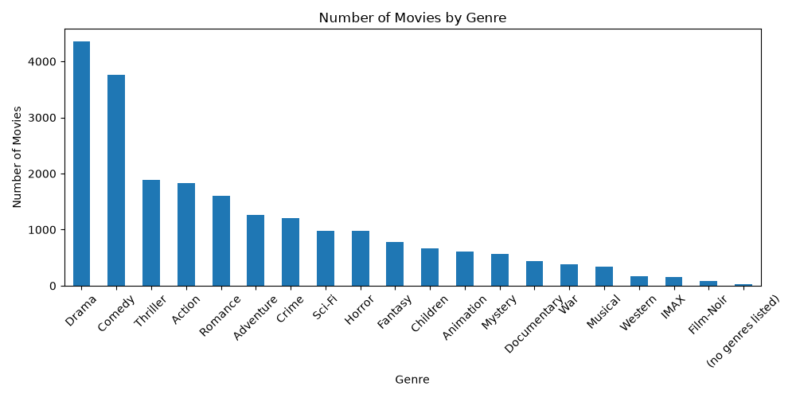
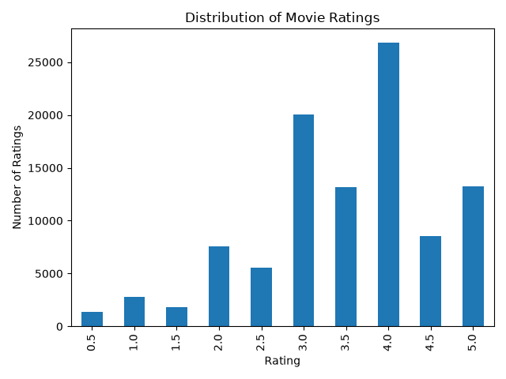
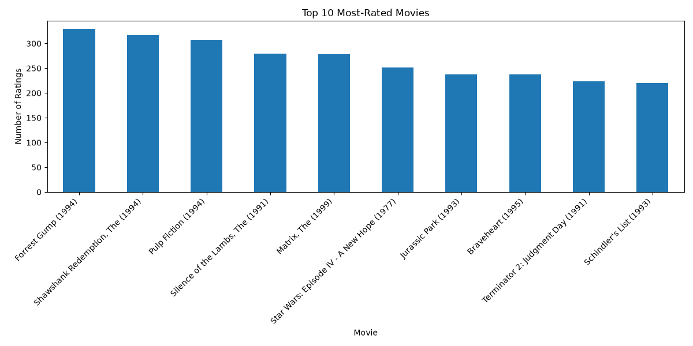

# Movie Recommendation System

An AI-based movie recommendation system that recommends movies to users based on the rating patterns of similar users.

## Objective

The objective of this project is to build a basic collaborative filtering recommendation system that analyzes user ratings and recommends movies that a user has not previously rated.

## Dataset

This project uses the MovieLens `ml-latest-small` dataset.

The dataset contains:
- `ratings.csv` — User ratings for movies
- `movies.csv` — Movie titles and genres
- `links.csv` — Movie identifiers linked to external databases
- `tags.csv` — User-generated movie tags

Dataset statistics:
- 100,836 ratings
- 610 users
- 9,742 movies
- 3 movie-related columns in `movies.csv`
- 4 rating-related columns in `ratings.csv`

## Technologies Used

- Python
- Pandas
- NumPy
- Scikit-learn
- Matplotlib
- Seaborn

## System Workflow

The recommendation system follows these steps:

1. Load the MovieLens movie and rating datasets.
2. Merge movie and rating information for analysis.
3. Perform data analysis and check the dataset.
4. Create visualizations for movie genres, rating distribution, and popular movies.
5. Create a user-movie rating matrix using Pandas `pivot()`.
6. Fill missing values with 0 temporarily for similarity calculation.
7. Calculate user similarity using cosine similarity.
8. Identify the five most similar users for the selected user.
9. Retrieve ratings given by the similar users.
10. Calculate similarity-weighted recommendation scores.
11. Ignore movies that have been rated by fewer than two similar users.
12. Remove movies that the selected user has already rated.
13. Sort movies by recommendation score.
14. Return the top 10 recommended movies.
15. Save the recommendations as a CSV file.

## Collaborative Filtering

This project uses **user-based collaborative filtering**.

The system assumes that users who have similar rating patterns may have similar movie preferences.

For a selected user:

```text
Selected User
      ↓
Find Similar Users
      ↓
Get Their Movie Ratings
      ↓
Apply Similarity Weights
      ↓
Calculate Recommendation Scores
      ↓
Remove Already-Rated Movies
      ↓
Sort by Score
      ↓
Top 10 Recommendations

## Visualizations

The project includes the following visualizations:

### 1. Number of Movies by Genre

Shows the distribution of movies across different genres.



### 2. Distribution of Movie Ratings

Shows how frequently different ratings occur in the dataset.



### 3. Top 10 Most-Rated Movies

Shows the movies that received the highest number of ratings in the dataset.



## How to Run

### Prerequisites

Make sure Python 3.13 or later is installed on your system.

### Step 1: Clone the Repository

```bash
git clone <your-github-repository-url>
cd Movie_recommendation
```

### Step 2: Create a Virtual Environment

```bash
python -m venv venv
```

### Step 3: Activate the Virtual Environment

For Windows PowerShell:

```powershell
.\venv\Scripts\Activate.ps1
```

After activation, `(venv)` should appear at the beginning of the terminal.

### Step 4: Install Dependencies

```bash
pip install -r requirements.txt
```

### Step 5: Run the Recommendation System

```bash
python main.py
```

The program will ask for a user ID:

```text
Enter user ID: 25
```

The system will then generate the top 10 movie recommendations for the selected user.

### Step 6: View the Output

The recommendations will be displayed in the terminal with:

* Movie ID
* Movie title
* Genres
* Recommendation score

The recommendations are also saved automatically as a CSV file:

```text
recommendations_user_25.csv
```

For a different user, enter their corresponding user ID when prompted.


## Results

The recommendation system was tested with multiple users from the MovieLens dataset.

For each selected user, the system identifies similar users based on their rating patterns and generates a ranked list of 10 movies that the selected user has not previously rated.

Example output:

| Movie ID | Movie Title | Genre | Score |
|----------|-------------|-------|-------|
| 318 | The Shawshank Redemption (1994) | Crime\|Drama | 4.74 |
| 1291 | Indiana Jones and the Last Crusade (1989) | Action\|Adventure | 4.67 |
| 2959 | Fight Club (1999) | Action\|Crime\|Drama\|Thriller | 4.61 |

The recommendation scores are calculated using similarity-weighted ratings from the most similar users.

## Features

- User-based collaborative filtering
- Cosine similarity for finding similar users
- Similarity-weighted recommendation scoring
- Top 10 personalized movie recommendations
- Filtering of movies already rated by the user
- Minimum rating threshold for more reliable recommendations
- Movie genre and rating analysis
- Data visualizations
- CSV export of recommendations
- User ID validation

## Conclusion

This project demonstrates a basic user-based collaborative filtering system for personalized movie recommendations. The system analyzes user rating patterns, identifies users with similar preferences, and uses their ratings to generate personalized movie recommendations.

The project also includes exploratory data analysis, visualizations, and CSV output to provide a complete recommendation system workflow.
